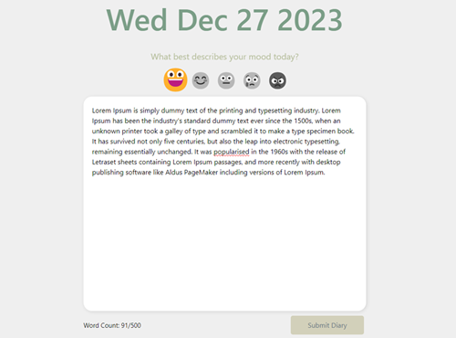
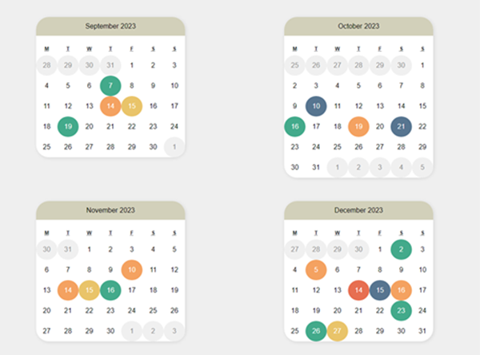
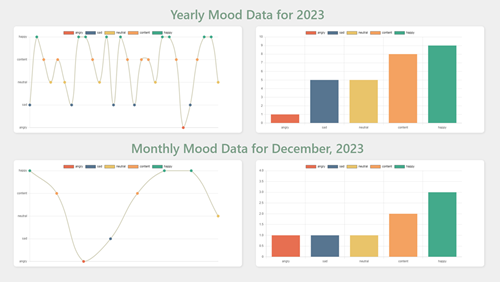

**Mood Tracker**

Cute and cozy mood tracker application where users can keep track of their daily moods and how their day went. 



Includes a dynamic and easy-to-use interactive calendar interface, allowing users to effortlessly navigate and review mood data. Each mood has its own designated color that users can see on the calendar.



Mood trend visualization using Chart.js, providing users with insightful analytics of their emotional patterns over time and reflect on their yearly and monthly moods



## Technologies Used
- MongoDB
- Express.js
- React (with TypeScript)
- Node.js

## Getting Started
### Prerequisites
- Node.js
- npm
- MongoDB

### Installation and Running the App

**Clone the repository**
```bash
git clone https://github.com/angenue/MoodJournal.git
cd mood-tracker
```

**Run Backend**
Navigate to the backend directory and start the server:
```bash
cd backend
npm install
npm start
```

**Run Frontend**
In a separate terminal, navigate to the frontend directory and start the React app:
```bash
cd frontend
npm install
npm start
```

